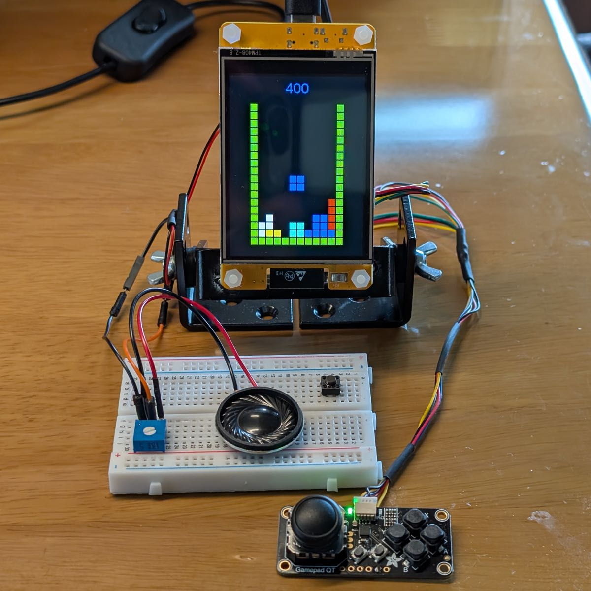

# Gamepad_Seesaw
A high-speed version of the [Adafruit_Seesaw][1] library for [Adafruit Mini I2C Gamepad][2].
It is suitable for game emulators that require fast response, especially for [Galagino][5] 
on ESP32-2432S028R (AKA [Cheap Yellow Display][4]).

  

## Response Time
For a game emulator, response time to user input is very important.

For example, when running [Galagino][5] on CYD, connecting Adafruit Gamepad using Seesaw library instead of a Nunchuk controller with [NintendoExtensionCtrl][3] will significantly slow down gameplay on [Frogger][6] and [Dig Dug][7].

Since Adafruit_Seesaw supports a variety of peripheral devices, it contains redundant processing for Gamepad. So I have slimmed down the redundant parts and made modifications specifically for the Gamepad to make it faster.

Here is the average processing time for one scan:
| Library               | Controller                    | Response Time |
| --------------------- |------------------------------ |--------------:|
| NintendoExtensionCtrl | Nunchuk                       | 1233 usec     |
| ^                     | NES Classic Mini              | 1349 usec     |
| ^                     | Classic controller            | 1491 usec     |
| **Gamepad_seesaw**    | **Adafruit Mini I2C Gamepad** | **1198** usec |
| Adafruit_seesaw       | ^                             | 2482 usec     |

The only downside of Adafruit Gamepad is that it's small, but I think it's easier to play with than a Nunchuk controller.

## Dependencies

- [adafruit/Adafruit_BusIO][8]

## Related Resouces

- [adafruit/Adafruit_Seesaw][1]
- [Adafruit Mini I2C Gamepad with seesaw - STEMMA QT / Qwiic][2]
- [dmadisonNintendoExtensionCtrl][3]
- [witnessmenow/ESP32-Cheap-Yellow-Display][4]
- [harbaum/galagino][5]

[1]: https://github.com/adafruit/Adafruit_Seesaw "adafruit/Adafruit_Seesaw: Arduino library driver for seesaw multi-use chip"
[2]: https://www.adafruit.com/product/5743 "Adafruit Mini I2C Gamepad with seesaw - STEMMA QT / Qwiic : ID 5743 : Adafruit Industries, Unique &amp; fun DIY electronics and kits"
[3]: https://github.com/dmadison/NintendoExtensionCtrl "dmadison/NintendoExtensionCtrl: Arduino library for communicating with Nintendo extension controllers"
[4]: https://github.com/witnessmenow/ESP32-Cheap-Yellow-Display "witnessmenow/ESP32-Cheap-Yellow-Display: Building a community around a cheap ESP32 Display with a touch screen"
[5]: https://github.com/harbaum/galagino "harbaum/galagino: A Galaga, Pac-Man and Donkey Kong arcade emulator for the ESP32"
[6]: https://en.wikipedia.org/wiki/Frogger "Frogger - Wikipedia"
[7]: https://en.wikipedia.org/wiki/Dig_Dug "Dig Dug - Wikipedia"
[8]: https://github.com/adafruit/Adafruit_BusIO "adafruit/Adafruit_BusIO: Arduino library for I2C &amp; SPI abstractions"
